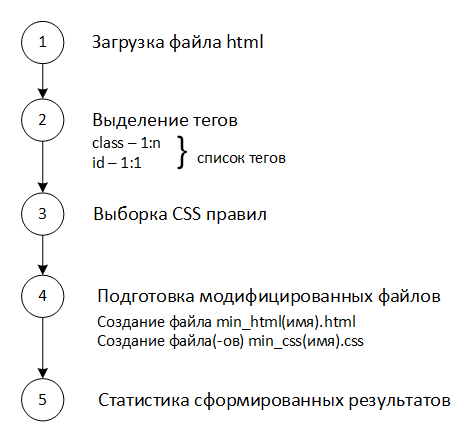

# Получение оптимизационного файла, минимизирующего структуру подгружаемых каскадных таблиц в HTML
(с) 2020 Лебедев Евгений

> практика по программированию

# Постановка задачи
Каскадные таблицы стилей или CSS — это язык, который используется для определения визуального представления веб-сайта на основе содержимого, содержащегося в документе языка разметки. Файлы стилей с расширением .css повсеместно применяются при создании различных веб-страниц. Они используются для задания шаблонов отображения текстовых и графических блоков той или иной веб-страницы. В процессе того, как мы заходим на веб-страницу, если браузер обнаруживает ссылки на таблицы стилей, он немедленно отправляет запрос на сервер и загружает файлы. Соответственно скорость загрузки напрямую зависит от оптимизации CSS кода. В данной работе главной целью как раз и является минимизация структуры подгружаемых каскадных таблиц стилей CSS в HTML.

# Функциональная структуры программы

## 1 блок (проверка существования файла)

## 2 блок (составление словаря, являющегося основанием для выборки css правил)

# План создания программы

> 1 блок:

Файл с разрешением .html проверяется на существование. Если такой файл существует, он загружается для обработки; в случае несуществования файла, выдается соответствующее сообщение об ошибке.

> 2 блок:

По существующему html файлу, формируются списки тегов, из которых выделяется информация, включающая: наименование тега; классы описывающие тег (может быть несколько); id, описывающее тег (единственное).

> 3 блок:

Из файла каскадных таблиц выделяются все строки, относящиеся к именам классов и идентификаторов из списка, сформированном во 2-ом блоке. Открывается css файл, строится словарь по типу: ключ - имя класса (идентификатора); значение - содержимое, между началом и концом описания класса (идентификатора).

> 4 блок:

Создается минимизированный файл разметки min_html(имя).html и минимизированные файлы каскадных таблиц min_css(имя).css. Файл html модифицируется (меняются имена подключаемых каскадных таблиц на имена, сформированные в 3 блоке), добавлением символа подчеркивания ('_').

> 5 блок:

Формируется статистика о проделанной работе. Пользователю выводятся результаты работы (количество файлов css, количество оптимизированных каскадных таблиц и т. д.).

## Описание функций программы htmltags.py:

> file_existance:

Функция проверки существования файла. Возвращает путь к файлу, если искомый файл существует, а также сообщение об ошибке в случае несуществования файла (блок схема 1).

> html_tags:

Функция, возвращающая список HTML тегов по документу .html. Примерный алгоритм работы: считывает каждую строчку документа .html, определяет наличие html тега в текущей строке; в случае, если тег в строке найден и он уникален в пределах документа, добавляет его в список.

> css_styles:

Функция, возвращающая список подгружаемых локальных css документов к html документу. Примерный алгоритм работы: считывает каждую строчку документа .html, определяет наличие тега link в строке; в случае, если путь к связываемому файлу не содержит подстроку "https", добавляет путь в список.
